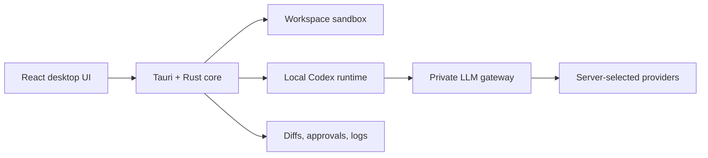

# Qunta

**A reviewable desktop coding agent built for developers who want local workspace control without exposing provider keys or routing details.**

Qunta combines a Tauri desktop shell, a React workspace UI, a Rust-native safety layer, a local Codex runtime, and a private server-side LLM gateway. It is designed around visible actions, explicit approvals, recoverable edits, and strict project boundaries.

> **Status:** `0.1.0` private-beta foundation. The repository contains the product architecture, desktop experience, safety modules, gateway contracts, tests, and packaging checks. Installer signing and external beta distribution are not complete yet.

## Why Qunta

Coding agents become useful when developers can understand and control what happens to their workspace. Qunta focuses on that trust layer:

- local project selection with explicit workspace boundaries;
- streamed agent timelines, terminal logs, and verification suggestions;
- patch previews before accepted changes are applied;
- approval controls for commands, writes, installs, Git, and network access;
- provider-neutral desktop behavior backed by a private LLM gateway;
- masked diagnostics and local audit history for recoverability.

## Product flow



The desktop client never receives raw provider keys. Provider selection, fallbacks, metering, and cost policy remain server-side.

## Included in the beta foundation

- Tauri desktop shell and React workspace UI.
- Project selection and workspace scanning.
- Prompt composer, session timeline, file tree, diff viewer, and terminal log panel.
- Command and patch approval contracts.
- Codex sidecar discovery and per-session configuration.
- Rust modules for path checks, patch application, Git status, and command policy.
- Cloud API contracts for authentication, plans, usage, billing, and updates.
- LLM gateway adapters and normalized streaming contracts.
- Release, packaging, security, and E2E smoke documentation.

## Safety model

Qunta defaults to a review-first workflow.

| Mode | File edits | Shell commands |
| --- | --- | --- |
| Suggest | Approval required | Approval required |
| Auto Edit | Diff preview with safe edit policy | Approval required |
| Controlled Full | Policy-controlled | Explicit high-risk approvals |

Sensitive paths such as environment files, SSH keys, cloud credentials, and registry tokens are deny-read by default. File operations must remain inside the selected project root.

## Architecture

```text
apps/desktop          Tauri shell and native application configuration
apps/desktop-ui       React chat, timeline, files, diffs, approvals, settings
crates/desktop-core   Local state, diagnostics, path validation, Tauri commands
crates/agent-runner   Codex process lifecycle, sessions, events, cancellation
crates/sandbox        Workspace boundaries, command policy, safe patch apply
services/api          Accounts, plans, usage, billing, update metadata
services/llm-gateway  Provider-hidden routing, adapters, streaming, metering
packages/shared-types Shared contracts across desktop and cloud services
packages/ui           Reusable presentational UI primitives
```

Read the deeper design documents in [`docs/architecture.md`](docs/architecture.md), [`docs/security-threat-model.md`](docs/security-threat-model.md), and [`docs/product-requirements.md`](docs/product-requirements.md).

## Development requirements

- Node.js 22 or newer
- pnpm 10 through Corepack
- Rust toolchain compatible with the workspace
- Platform dependencies required by Tauri

Install JavaScript dependencies:

```bash
corepack enable
corepack pnpm install
```

Run the full repository check:

```bash
corepack pnpm check
cargo fmt --check
cargo clippy --all-targets --all-features -- -D warnings
cargo test
git diff --check
```

Package and validate a beta candidate:

```bash
corepack pnpm --filter @qunta/desktop-ui build
corepack pnpm package:desktop:smoke
corepack pnpm release:beta:check
```

## Current limitations

- Installer signing still requires maintainer release keys.
- Auto-update is notify-only in the beta foundation.
- Billing integration uses a mock/manual beta contract.
- Some agent execution paths remain mocked for smoke coverage.
- Native installers must be produced and checked on their target platforms.

## Direction

Qunta is being built as a sellable multi-product foundation for controlled local coding assistance. Near-term work is focused on native packaging, signed releases, real beta sessions, gateway operations, and tightening the approval and recovery experience.
